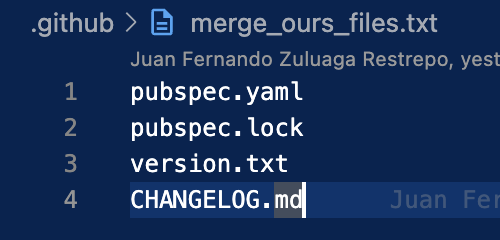

# Sync branches action 🤖 

A GitHub Action to syncs branches on your repo 🎉. Automatize yours merge to others branches and creates the Pull Request automatically.

## Features

- **Merge in other branches**: When a Pull Request is closed and merged, this actions detect from the title of commit the destinies branches to sync.
- **Auto create a Pull Request**: When the syncs finalize the action will create a new pull requests to syncs the target branches.
- **Multiple branch Support**: The action support max two branch to sync.
- **Flexible config**: This actions provide multiple forms to config, especially for the files that you don't like to merge.
- **Message and log**: This action provide a clear log that allows you to see what happend when is running.
- **Easy to use**: Just works when a Pull Request is accepted.


## How it works

### Trigger

Actions will trigger when a Pull Request is completed and merged.

### Extraction of branches

The action takes the names of the branch to sync with you commit message of your Pull Request, for do that your commit message must have the next sentence:

**<namebranch1&namebranch2>**


> [!IMPORTANT]
> This sentence must be in the last part of the commit message.

When the Pull Request is accepted, the action will be executed

**namebranch1**: The name of the first branch to sync.

**namebranch2**: The name of the seconds branch to sync.

> If you want a sync just one branch, your sentence must be: \<namebranch1>

### Notes

When the Pull Request has complete and merge to the target branch, this action realize a merge between that target branch an the branches selected in the commit message of the Pull Request.

## Limitations

Sync branch action only works with max two branches to sync at the same time.


## Exclude files

If you want to exclude files in your branch to be sync, you can create a txt file that contains those files, for example:



## Usage

### Basic Setup

```yaml
- name: Sync branch action
  uses: bancolombia/sync-branch-action@v1
```

### Advanced Configuration

```yaml
- name: Run Sync Branches Action
    uses: ./
    with:
      github_token: ${{ secrets.PERSONAL_ACCESS_TOKEN_JF }}
      user_name: 'github-actions[bot]'
      user_email: 'github-actions[bot]@users.noreply.github.com'
      ours_files_list: '.github/merge_ours_files.txt'
```

### Complete Workflow Example

```yaml
name: Sync Branches Action Test

on:
  pull_request:
    types: [closed]

jobs:
  test:
    runs-on: ubuntu-latest
    if: github.event.pull_request.merged == true
    steps:
      - name: Run Sync Branches Action
          uses: ./
          with:
            github_token: ${{ secrets.PERSONAL_ACCESS_TOKEN_JF }}
            user_name: 'github-actions[bot]'
            user_email: 'github-actions[bot]@users.noreply.github.com'
            ours_files_list: '.github/merge_ours_files.txt'
```

## Inputs

| Input | Description | Required | Default | Examples |
|-------|-------------|----------|---------|----------|
| `channel` | Flutter channel to install | No | `stable` | `stable`, `beta`, `dev` |
| `flutter-version` | Exact Flutter version or "latest" | No | `latest` | `3.32.0`, `latest` |
| `java-version` | Temurin Java version (empty to skip) | No | `17` | `11`, `17`, `21` |
| `cache` | Enable caching for faster builds | No | `true` | `true`, `false` |
| `cache-key-suffix` | Suffix for manual cache invalidation | No | `""` | `v1`, `2024-01` |


## Contributing

We welcome contributions! Please see our [contributing guidelines](CONTRIBUTING.md) for details.

## License

This project is licensed under the MIT License - see the [LICENSE](LICENSE) file for details.

## Support

For support and questions:
- Open an issue in this repository
- Check existing issues for similar problems
- Review Flutter's official documentation

## Changelog

See [RELEASES](https://github.com/bancolombia/flutter-setup-action/releases) for version history and changes.